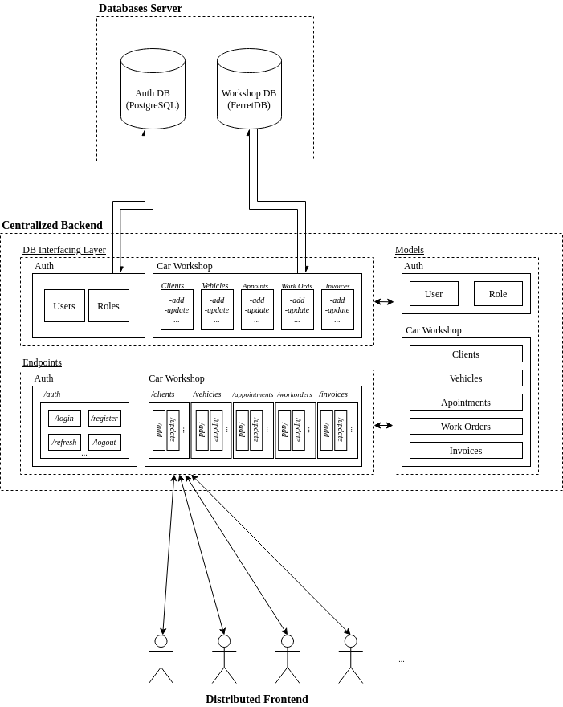

# Backbone Architecture

This backend is composed of three main components:
- **Models**: reflect the tables in the DBs
- **DB Interfacing Layer**: functions which will interact with the DBs
- **Endpoints**: functions which will publish endpoints and call the DB Interfacing Layer

