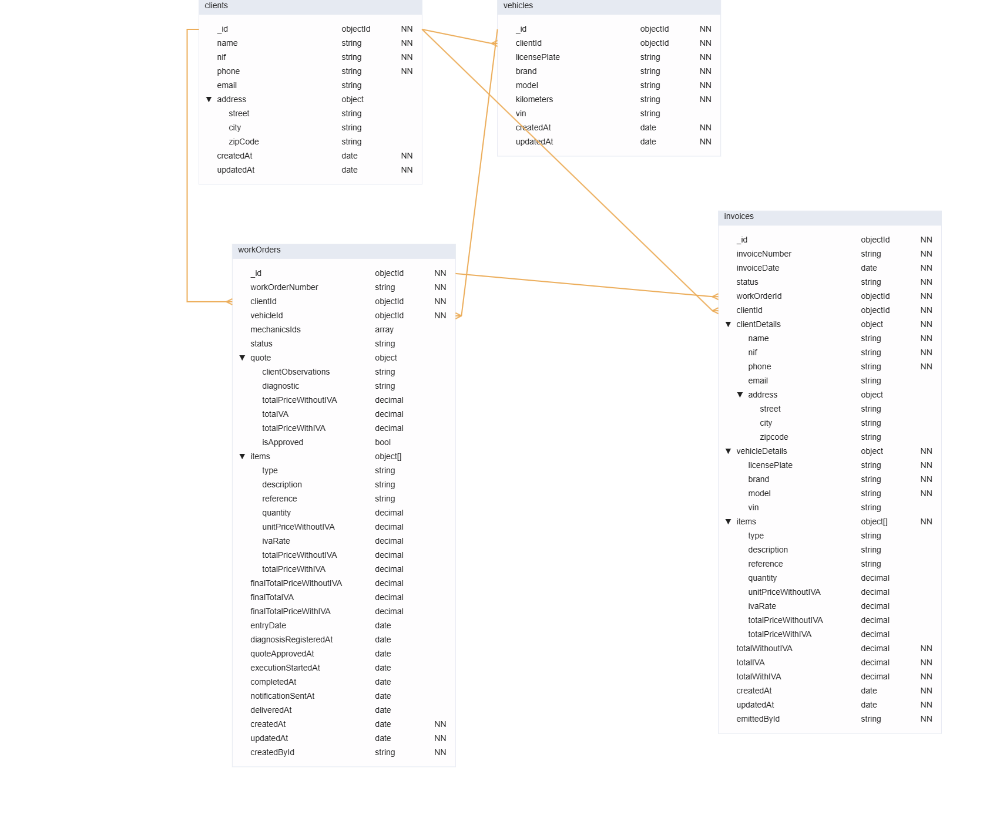

# StArranja Database Architecture (MongoDB)

## 1. Introduction

This document outlines the MongoDB data model for the StArranja project. The architecture is designed to be scalable, performant, and flexible, supporting all functional and non-functional requirements for the workshop management system.

The model is **hybrid**, using a combination of **Referencing** (for data consistency) and **Embedding** (for query performance) to create a robust system.

### Key Technical Standards
* **Dates:** All date fields must be stored using the `ISODate` type for universal, sortable timekeeping.
* **Finance:** All monetary values (prices, totals) and non-integer quantities (like hours) **must** use the `Decimal128` type to prevent floating-point rounding errors.
* **Relations:**
    * `ObjectId` is used for internal references (e.g., `clientId`, `vehicleId`).
    * `String` (UUID) is used for external references to the PostgreSQL `users` table (e.g., `mechanicsIds`).

---

## 2. Visual Schema Diagram

---

## 3. Collection: `clients`

Stores the primary customer records for the workshop. This collection is referenced by `vehicles`, `workOrders`, and `invoices`.

### Schema Definition

| Field | Type | Required | Description |
| :--- | :--- | :--- | :--- |
| `_id` | `ObjectId` | ✓ | Unique document identifier. |
| `name` | `String` | ✓ | Customer's full name. |
| `nif` | `String` | ✓ | Customer's 9-digit NIF (Tax ID). Must be unique. |
| `phone` | `String` | ✓ | Primary contact phone number. |
| `email` | `String` | | Customer's email address. |
| `address` | `Object` | | Embedded object for the customer's address. |
| `address.street`| `String` | | |
| `address.city` | `String` | | |
| `address.zipCode`| `String` | | |
| `createdAt` | `ISODate` | ✓ | Timestamp when the client was created. |
| `updatedAt` | `ISODate` | ✓ | Timestamp of the last update. |

### Indexes

| Field(s) | Type | Purpose |
| :--- | :--- | :--- |
| `{ nif: 1 }` | **Unique** | Enforces that no two clients can have the same NIF. |
| `{ phone: 1 }` | Simple | Fast lookup by phone number. |
| `{ email: 1 }` | Unique, Partial | Enforces unique emails *if* the email field exists. |

---

## 4. Collection: `vehicles`

Stores all vehicle records. Each vehicle is owned by a single client from the `clients` collection.

### Schema Definition

| Field | Type | Required | Description |
| :--- | :--- | :--- | :--- |
| `_id` | `ObjectId` | ✓ | Unique document identifier. |
| `clientId` | `ObjectId` | ✓ | **Reference** to the `_id` in the `clients` collection. |
| `licensePlate` | `String` | ✓ | Vehicle's license plate. Must be unique. |
| `brand` | `String` | ✓ | e.g., "Renault" |
| `model` | `String` | ✓ | e.g., "Clio" |
| `vin` | `String` | | 17-character Vehicle Identification Number (Chassis Nr.). |
| `lastKnownKilometers` | `Number` | | Last recorded mileage (optional). |
| `createdAt` | `ISODate` | ✓ | Timestamp when the vehicle was created. |
| `updatedAt` | `ISODate` | ✓ | Timestamp of the last update. |

### Indexes

| Field(s) | Type | Purpose |
| :--- | :--- | :--- |
| `{ licensePlate: 1 }` | **Unique** | Enforces that no two vehicles can have the same license plate. |
| `{ clientId: 1 }` | Simple | Fast lookup for all vehicles belonging to a specific client. |
| `{ vin: 1 }` | Unique, Partial | Enforces unique VINs *if* the VIN field exists. |

---

## 5. Collection: `workOrders`

This is the core collection, tracking the entire lifecycle of a repair job. It references a `client` and `vehicle` and embeds its own `quote` and `items`.

### Schema Definition

| Field | Type | Required | Description |
| :--- | :--- | :--- | :--- |
| `_id` | `ObjectId` | ✓ | Unique document identifier. |
| `workOrderNumber` | `String` | ✓ | Sequential, human-readable ID (e.g., "2025-0001"). |
| `clientId` | `ObjectId` | ✓ | **Reference** to the `_id` in the `clients` collection. |
| `vehicleId` | `ObjectId` | ✓ | **Reference** to the `_id` in the `vehicles` collection. |
| `mechanicsIds` | `Array` | | Array of `String` (UUIDs) **referencing** the `users` table in PostgreSQL. |
| `status` | `String` | ✓ | The current stage of the job. Must be one of: `AwaitingApproval`, `Approved`, `AwaitingParts`, `InProgress`, `Completed`, `Invoiced`, `Delivered`. |
| `quote` | `Object` | | **Embedded** object for the diagnostic and budget. |
| `items` | `Array` | | **Embedded** array of objects (see `items` schema below). |
| `finalTotalPrice...` | `Decimal128` | | Final totals calculated from the `items` array. |
| `entryDate` | `ISODate` | ✓ | Timestamp: Vehicle check-in. |
| `diagnosisRegisteredAt`| `ISODate` | | Timestamp: Quote/diagnostic registered. |
| `quoteApprovedAt` | `ISODate` | | Timestamp: Customer approval (RB06). |
| `completedAt` | `ISODate` | | Timestamp: Work completed (triggers RB07). |
| `deliveredAt` | `ISODate` | | Timestamp: Vehicle delivered to customer. |
| `createdAt` | `ISODate` | ✓ | Timestamp when the document was created. |
| `updatedAt` | `ISODate` | ✓ | Timestamp of the last update. |

### Embedded Schema: `quote`

| Field | Type | Description |
| :--- | :--- | :--- |
| `clientObservations` | `String` | The customer's complaint/notes. |
| `diagnostic` | `String` | The mechanic's technical diagnosis (RF04). |
| `isApproved` | `Boolean` | `true` when the customer approves the budget (RB06). |

### Embedded Schema: `items` (Array element)

| Field | Type | Description |
| :--- | :--- | :--- |
| `type` | `String` | Enum: `Part` or `Labor`. |
| `description` | `String` | e.g., "5W-30 oil" or "Filter change labor". |
| `reference` | `String` | Part number or internal code (RB03). |
| `quantity` | `Decimal128` | Units or hours (RB03). |
| `unitPriceWithoutIVA`| `Decimal128`| Cost per unit/hour (RB03, RF06). |
| `ivaRate` | `Decimal128`| Tax rate, e.g., `0.23`. |
| `totalPriceWithIVA` | `Decimal128`| Calculated total for the line item (RF06). |

### Indexes

| Field(s) | Type | Purpose |
| :--- | :--- | :--- |
| `{ vehicleId: 1 }` | **Partial, Unique** | **Implements RB02**. `{"status": { "$nin": ["Completed", "Invoiced", "Delivered"] } }`   Ensures a vehicle has only ONE active work order. |
| `{ workOrderNumber: 1 }`| **Unique** | Fast lookup by the human-readable number. |
| `{ status: 1 }` | Simple | Fast queries for the Dashboard (e.g., "all `InProgress` WOs"). |
| `{ clientId: 1 }` | Simple | Fast lookup for a client's full repair history. |
| `{ mechanicsIds: 1 }` | Simple | Fast lookup for a mechanic's assigned tasks (Dashboard). |

---

## 6. Collection: `invoices`

Stores finalized, immutable billing records. This collection **"snapshots"** (copies) data from `workOrders` to ensure fiscal integrity (RNF05).

### Schema Definition

| Field | Type | Required | Description |
| :--- | :--- | :--- | :--- |
| `_id` | `ObjectId` | ✓ | Unique document identifier. |
| `invoiceNumber` | `String` | ✓ | Sequential, official invoice number (e.g., "FT 2025/1"). |
| `invoiceDate` | `ISODate` | ✓ | Date the invoice was officially emitted. |
| `status` | `String` | ✓ | Enum: `Emitted`, `Paid`, `Canceled`. |
| `workOrderId` | `ObjectId` | ✓ | **Reference** to the source `workOrders._id`. |
| `clientId` | `ObjectId` | ✓ | **Reference** to the `clients._id`. |
| `clientDetails` | `Object` | ✓ | **Snapshot** of client data at the time of invoicing. |
| `vehicleDetails` | `Object` | ✓ | **Snapshot** of vehicle data at the time of invoicing. |
| `items` | `Array` | ✓ | **Snapshot** (deep copy) of the `items` array from the work order. |
| `totalWithoutIVA` | `Decimal128` | ✓ | **Snapshot** of the final total. |
| `totalIVA` | `Decimal128` | ✓ | **Snapshot** of the final total. |
| `totalWithIVA` | `Decimal128` | ✓ | **Snapshot** of the final total. |
| `createdAt` | `ISODate` | ✓ | Timestamp when the invoice was created. |
| `updatedAt` | `ISODate` | ✓ | Timestamp (e.g., when moving `status` to `Paid`). |

### Business Logic (Application Layer)

* **RB01 Implementation:** The application layer (backend) **must** verify that a `workOrder` has a `status` of `Completed` *before* it allows the creation of a corresponding `invoice` document.

### Indexes

| Field(s) | Type | Purpose |
| :--- | :--- | :--- |
| `{ invoiceNumber: 1 }` | **Unique** | Ensures no duplicate invoice numbers (fiscal requirement). |
| `{ workOrderId: 1 }` | **Unique** | Ensures a work order can only be invoiced once. |
| `{ clientId: 1 }` | Simple | Fast lookup for all invoices for a specific client. |
| `{ invoiceDate: -1 }` | Simple | Fast sorting for financial reports (newest first). |